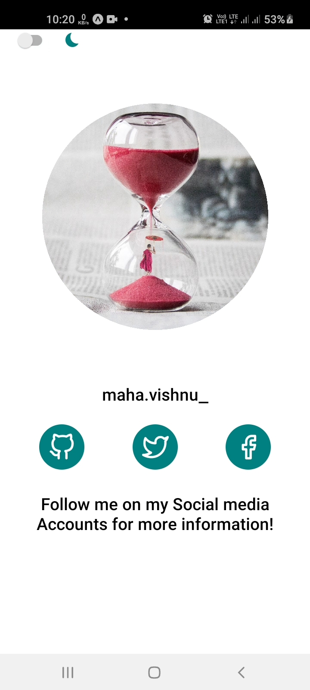
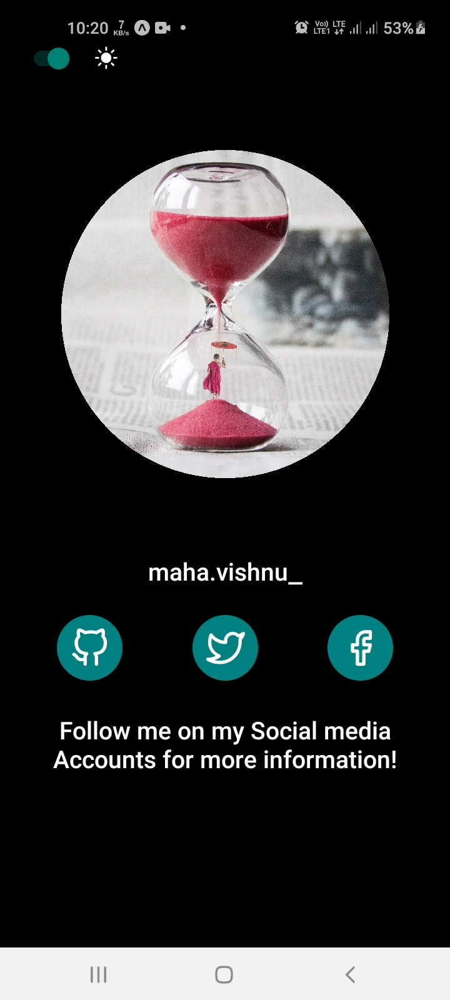

# Ract-Native Toggle-DarkMode
<h2>Expo Clients</h2>
<h1>Requirements</h1>
<ul>
<li><pre>npm i @expo/vector-icons</pre></li>
</ul>
<h1>Demo</h1>
<pre>
<li>

</li>
</pre>
<h2>
<a href="https://www.instagram.com/maha.vishnu_/" title="maha.vishnu_">
</h2>